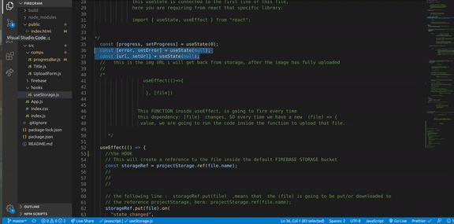

# APP in (PROGRESS)

#### STEPS

<ul>

<li>1_ INSTALL all the dependencies in the folder by typing: npm install </li>

<li>2_ If the page dont show in the browser, INSTALL the following: npm install autoprefixer@9.8.0</li>
<li>3_ INSTALL the gh pages dependency by typing: npm install gh-pages --save-dev</li>
<li>4_ PRESUMING you already have the git repo ready and all is already uploaded, Go to the console and type: npm run build</li>
<li>5_ After that type: npm run deploy</li>
<li>6_ DONT FORGET to add the:   "homepage": "https://yourpage.github.io/yourprojectrepo"  , ont he top of the package json , just above  "name": "firegram". </li>

 </ul>

 

#### STEPS FIREBASE

 

<ul>

<li>7_ Go to FIREBASE: https://firebase.google.com/ </li>
<li>8_ click on : Go to the console , at the right-top of the page</li>
<li>9_ CREATE A PROJECT: type whatever name you want, ONCE its ready click continue.</li>
<li>10_ click on the new "web icon" at the center of the page(one  of the 3 white circles)</li>
<li>11_ once you clicked on the icon: call it firegram</li>
<li>12_ it will show you a code, copy the code of the script in the middle of the page</li>
<li>13_ GO to VS and create a folder inside the src, called "firebase" and then create a file called config.js inside the firebase folder</li>
<li>14_ PASTE de script code inside the config.js</li>
<li>15_ DONT WORRY about the error, its due to the fact you still dont have firebase installed and imported</li>
<li>16_ to import it type the following on the top of the config.js file: import * as firebase from "firebase/app";
</li>
<li>_17 The following will serve to store the images, in the same file type the following: import "firebase/storage"; </li>
<li>_18 The following will serve to build the database, in the same file type the following: import "firebase/firestore"; </li>

 </ul>
<!-- ----------------------- -->
<!--       FIREGRAM          -->
<!-- ----------------------- -->

 
 
 
 

###### handling hooks | img in DATABASE

 
 

###### Connecting the DB to the docs | showing the images on the browser

###### CREATE THE MODAL | ADDING THE MOTION for the animation

